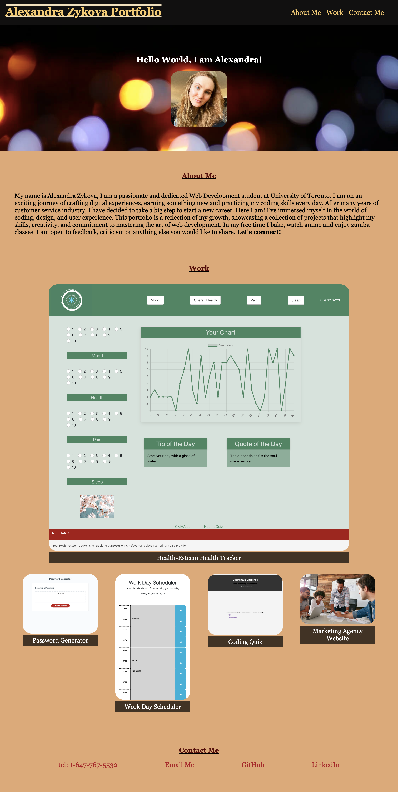

# <Alexandra Zykova Professional Portfolio>

## Description

This project contains ready-to-use webpage for my professional portfolio. I have made it easy to use and edit in the future. The purpose of it is to howcasing my projects, skills, achievements and improvement. The website is visually appealing, user-friendly, and responsive, ensuring a seamless experience across various devices. Feel free to explore the code and content to learn more about me and my work!

## Features

About me: introducing myself and providing a brief message.
Work: Showcase of my projects with title, images, and links.
Contact: A contact me section to get in touch with me directly.
Responsive Design: The website is designed to adapt and look great on various screen sizes.

## Installation

No installation required.

## Usage

The website can be accessed [here](https://alexandrazykova.github.io/professional-portfolio/)

## License

Please refer to the LICENSE in the repo.
